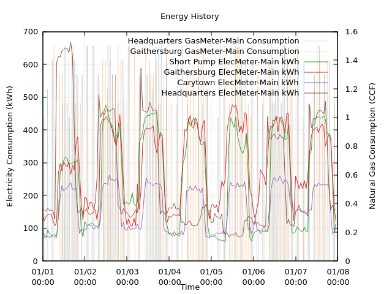

# Haystack Lua

Haystack Lua provides bindings to the `haystack-types` crate. 

## Overview

Haystack Lua enables the parsing and manipulation of Haystack data types. This library is intended to be used in a similar fashion to AWK/GAWK where zinc data is piped into lua scripts and transformed as needed.

## Features

- 🔄 **Zinc Format Parsing**: Complete support for Haystack Zinc formatted grids, lists and dictionaries
- 📊 **Grid Operations**: Parse, manipulate, and iterate over data grids and metadata
- 📚 **Dictionary Support**: Dictionary operations with type safety
- 🏷️ **Rich Data Types**: Bool, Number, String, Reference, Date, Time, Coordinate, etc.
- 🔗 **Pipeline Friendly**: Designed for command-line data processing workflows
- ⚡ **Performance**: Built in Rust for speed and memory safety

## Installation

### Prerequisites

- Lua 5.1+ (supports 5.1, 5.2, 5.3, 5.4, LuaJIT, and Luau)
- Rust/Cargo toolchain for building

### Using LuaRocks

```bash
# In my case, cargo was installed under ~/.cargo. You should be able to leave out the RUST_DIR param if rust is installed system-wide.
# Substitute RUST_DIR as required

# To install using the rockspec in your working directory
luarocks install haystack-dev-1.rockspec RUST_DIR=/home/USERNAME/.cargo

# To install from LuaRocks (may require admin permissions for system wide install)
sudo luarocks install --server=https://luarocks.org/dev haystack RUST_DIR=/home/USERNAME/.cargo

# Alternatively, to install for current user only
luarocks install --server=https://luarocks.org/dev haystack --local RUST_DIR=/home/USERNAME/.cargo
```

### Building from Source

```bash
git clone https://github.com/candronikos/haystack-rust.git

## Must pass exactly one lua version as a feature flag
cargo build -p haystack-lua --release --features lua54
```

## Quick Start

### Basic Usage

```lua
local hs = require('haystack')

-- Parse a simple Zinc grid
local zinc_data = [[
ver:"3.0"
id,dis
@p:demo,"Demo Site"
]]

local grid = hs.io.parse.zinc.grid(zinc_data)
print("Parsed", #grid, "rows")
print("First site:", grid:first().dis)
```

### Server Information Example

```lua
--[[
  haystack-client default about | lua haystack_about.lua
]]

local hs = require('haystack')

io.input(io.stdin)
local result = io.read("*all")

-- Parse zinc grid from stdin
local grid = hs.io.parse.zinc.grid(result)
-- Retrieve first row
local rec = grid:first()

-- Access and print fields from record
print("Haystack Server Info:")
print("---------------------")
print(string.format("Version:          %s", rec.haystackVersion))
print(string.format("Project:          %s", rec.projName))
print(string.format("Server Name:      %s", rec.serverName))
```

## Examples

The `examples/` directory contains comprehensive usage demonstrations:

| Example | Description | Usage |
|---------|-------------|-------|
| **haystack_about.lua** | Display server information | `haystack-client about \| lua haystack_about.lua` |
| **haystack_to_rec_ids.lua** | Extract record IDs for piping | `haystack-client read "point" \| lua haystack_to_rec_ids.lua` |
| **plot_history.lua** | Generate gnuplot script | `haystack-client hisRead @p:elec-point @p:gas-point \| lua plot_history.lua` |

### Visualization Example

The `plot_history.lua` example transforms historical data into gnuplot scripts:



*Example output showing electricity and gas consumption trends with dual-axis plotting*

## Current Limitations

**⚠️ Work in Progress**: This library is actively under development. While the core Zinc parsing functionality is stable and ready for use, please note the following current limitations:

- **Zinc Format Only**: Currently supports parsing of Zinc formatted data exclusively (grids, lists, dictionaries)
- **Read Operations**: Focused on data parsing and reading; write/serialization features are planned for future releases
- **API Evolution**: Some APIs may change as the library matures
- **Version Compatibility**: Only tested with Lua 5.4; not all mlua/lua features are supported equally across Lua versions

I'm always working to expand support and add new features. Contributions and feedback are welcome!